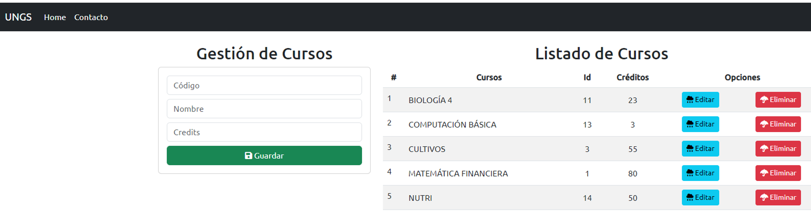

# Administracion_Universidad

A continuación, se presenta un proyecto que ofrece una demostración concisa de un modelo potencial de gestión para una institución educativa. Este proyecto se desarrolla utilizando tecnologías como Python, Django, JavaScript, PostgreSQL, Bootstrap, entre otras.

Se trata de una aplicación fullstack que permite a los usuarios interactuar con la base de datos a través de la interfaz visual proporcionada. Este enfoque integrado facilita la gestión eficiente de los datos y proporciona una experiencia de usuario fluida y efectiva.

